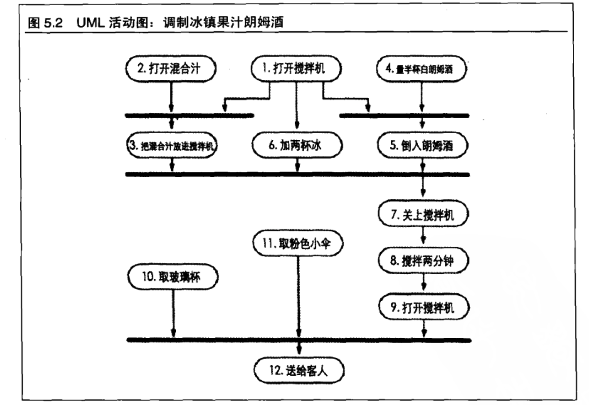
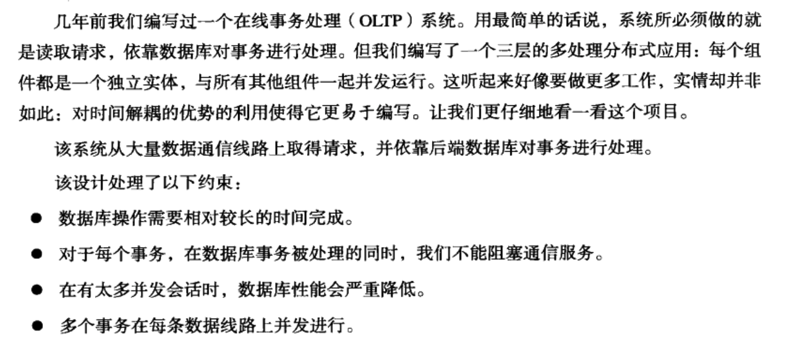
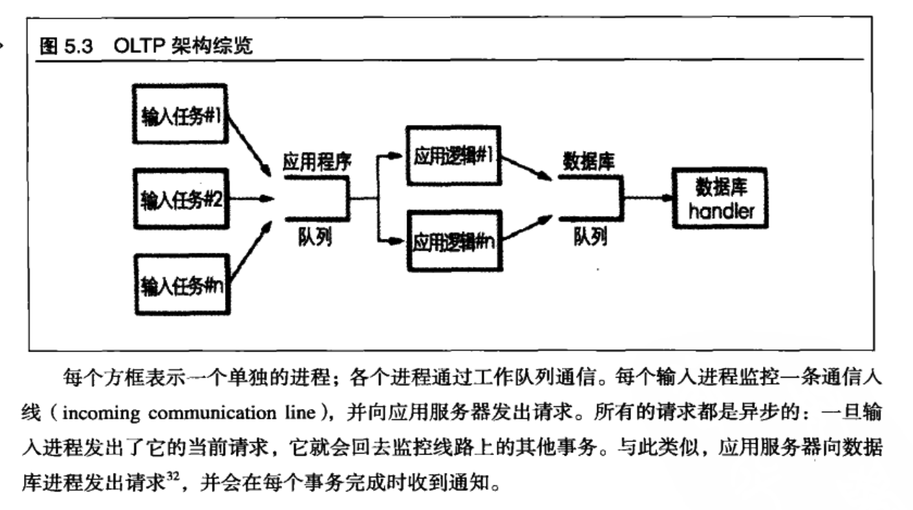

**为了能够赶上疯狂的变化步伐,我们要尽可能编写的宽松,灵活**  
## 好篱笆形成好邻居.  
代码组织成为最小的组织单位(模块),限制他们之间的交互.如果随后折中必须替换某个模块,其他的模块仍然可以工作.  

### 使耦合降低  
模块之间过多的相互了解有什么问题.  增加了系统的别的地方的一个无关的改动影响你的代码的风险.并且,会产生组合爆炸,也就是更改一个模块,就要所有的了解的模块都要参加编译.

### 得墨法则: 使得模块之间的耦合减少到最低.  
某个对象的任何方法,都应该只调用以下情形的方法.  
* 它自身的方法.  
* 传入它方法的参数的方法.  
* 它创建的对象的方法  
* 它持有的对象的方法.     

第一次看,好像是所有的方法调用都是的,但是其实不是这样的.  
1. 某个对象不是自己创建的,却调用了.  
``` B b = a.getB(); b.method() ```   
a是参数,b是从a得到的,b并不是在方法里面new出来或者栈上的数据.这样有什么问题,这个方法a是参数,但是在方法的内部,却需要B的信息.从这个方法看来,知道A类型的头文件就可以了,但是现在却需要B的头文件才可以.添加了耦合. 怎么解决呢,A类型添加方法,将功能包装在A的里面.  
从这里面看,想要遵守法则还是有代价的.如果b的功能不应该包装在A类型里面呢.


不过,模块分组也是有代价的:作为总承包人,你的模块,必须直接委托并且管理所有的子承包人,这就意味着,必须编写大量的包装方法,只是把请求转发给被委托者,这些包装方法既会代码运行时的代价,也会带来空间的开销,不过,对于程序编写人员来说,这也意味着逻辑的层数变多.到底如何平衡要自己把握,不过这也意味着,如果想要改善性能,可以返规范,用来换取速度.若干模块的紧密耦合,可以获得重大的性能改进.  

```  
class Date;
class Person {
private:
	Date *myBirthdate;
public:
	Person(Date &birthDate)	;
```  
我们经常按照上面的方式编写头文件,为什么. 头文件的用途是定义相应的实现和其他部分之间的接口,头文件是不用了解Date类内部的情况的,它只需要告诉编译器,构造器用了Date对象做参数.除非在头文件的内联函数里面用了Date.如果不用class Date的这种方式而引入Date的头文件,很快就使得一个头文件要被绝大多数的类所引用,那么更改这个头文件就意味着这个项目绝大多数要重新编译了.   


## 元程序设计  
首先,我们想要让我们的系统变得可配置,不仅仅是颜色,提示文本这样的事物,而是包括算法,数据库产品,中间技术,界面风格之类的深层次的选择. 这些选择应该作为配置选项,而不是通过集成实现.  
**要配置,不要集成**  
使用元数据,来描述应用的配置选项: 调试参数, 用户偏好,安装的目录.  
元数据: 严格来说,关于数据的数据.  例如,数据库里面的schema(不知道是什么,应该是描述表结构的东西).schema中含有按照名称,存储长度,其他属性,字段描述的信息.这里我们用最宽泛的范围描述元数据: **元数据** 是任何对应用进行描述的数据-->应该如何运行,应该使用什么资源.在典型的环境下,元数据是在运行时,而不是编译时被访问和使用的.  
这些东西经常使用吗,经常使用.win下的ini文件,macOs的propertyList,之前应用里面,存储了许许多多用户的偏好设置,在下一次启动的时候,根据这些设置来进行操作.  
### 元数据驱动的应用  
我们不仅仅是用在记录用户的偏好的范围,我们想要规定做什么,而不是怎么做,创建高度灵活和可适应的程序.  
**把抽象放进代码,把细节放进元数据**  
1. 这样可以迫使你解除设计的耦合,从而带来更加灵活,可适应好的程序
2. 迫使你推迟细节处理
3. 无需重新编译应用,就可以进行定制. 

### 元数据外部资料  
书里写的比较抽象.  
1.[知乎,元数据](https://www.zhihu.com/question/20679872)  


## 时间耦合   
时间有两个方面我们需要考虑: 并发(事情在同一时间发生了)和次序(事情在时间中的相对位置).  
编写程序的时候,事情往往是线性的. 先做什么,后做什么.这会带来时间的耦合,方法A必须在方法B之前调用.同一时间,只能有一个任务.我们需要容许并发,并且考虑消除时间或者次序上的依赖关系.这样可以获得灵活性,并且能够减少许多开发领域的关于时间的依赖.  
### 工作流 : 分析工作流,改善并发性
用户的工作流,是当做需求分析的一部分进行建模和分析的.找出同一时间可能发生什么,以及什么必须严格的次序发生.   
**UML活动图**  
  
从上面的图可以分析出来,顶层任务,1, 2, 4, 10, 11可以任意时刻同时发生,任务3, 5, 6随后并行执行.

### 书中的例子  
   
    

因为并发,所有的事情可能在同一时间发生,所以可能会有着某些基于时间的依赖关系.  
首先,必须要对任何的全局或者静态变量加以保护,免于并发访问.这个时候最好考虑下,为什么要有这个全局变量.另外,不管调用的次序是什么,都要保证给出的是一致的状态信息.例如:如果某些对象在某些调用之间无效,那么是不是就在依靠着,假设这个调用点没有人会调用这个对象.  
还有就是,之前代码里写出过的问题,这倒不是在并发环境里面,仅仅是方法调用顺序.在happin的某些代码里面,viewdidload里面设置了一个控制器的默认值,然而这个控制器又被当做一个子控制器放到了另外一个控制器内部,然后在alloc,init之后给那些值赋值了.但是其实,viewdidload里面又把这些值重新赋值为默认值了.这也是对于时间上调用的混乱造成的.控制器在创建之后,就是有效的状态了.可能在创建之后任何时候被调用.  
这种问题,往往是因为,构造和初始化分开定义,viewdidload里面写了很多应该在init中编写的初始化代码.不过,在viewdidload里面写初始化的代码又是很平常,因为大多数的控制器,都没有像上面的情况,需要在创建之后由外部进行一次初始化操作.之前的代码,会显示的调用以下[controller view]操作.很丑陋.    

### 更简洁的代码 
引入了并发之后,许多代码需要进行重新的思考.比如,有些代码,调用之后要进行一个重置的操作,因为数据会保留之前的状态.这很危险.因为在并发的时候,很有可能会在没有重置之前,又调用了这段代码.这种情况一般在同时操作一个内存空间时发生.在考虑了并发之后,1,加入线程安全代码.2 将重置这种操作,包装在函数内部,减少调用结束后没有重置引起的错误.毕竟,必须重置,这不是一个功能完善的方法.    


