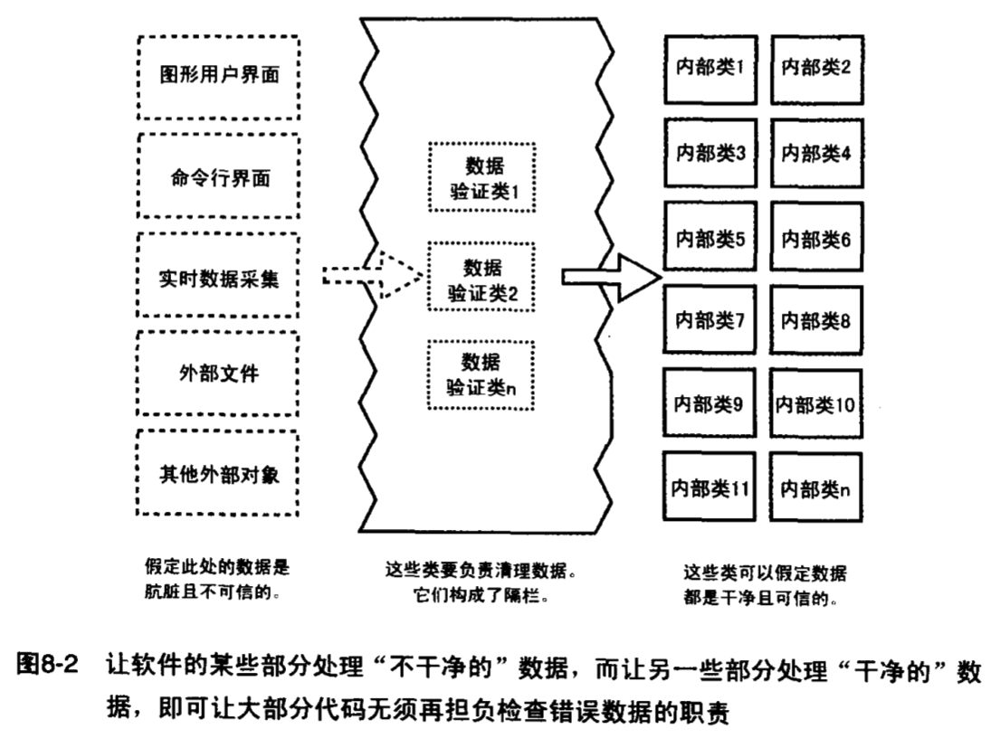

# 防御式编程  

## 避免程序遭受非法输入的破坏
* 好的程序
	* 垃圾进,什么都不出
	* 垃圾进,出去出错提示
	* 不允许垃圾进来
* 缺乏安全性的程序
	* 垃圾进,垃圾出
* 三种办法处理进来垃圾
	* 检查所有来源于外部的数据的值.确保在允许的范围之内.
	* 检查子程序的所有输入参数的值.
	* 决定如何处理错误的输入数据.

## 断言
* 断言,是指在开发期间使用的,让程序在运行时候进行自检的代码,断言为真,代表程序运行正常,断言为假,则意味着程序中发现了意料之外的错误.断言对于大型程序或者可靠性要求极高的程序尤其有用,通过断言,程序员可以快速的排查因为修改代码或者别的原因,导致的不匹配的接口假定和错误.  
* 断言可以用于代码的各种假定,澄清各种不希望的情形.断言主要是用在开发和维护阶段,通常只在开发阶段被编译进目标代码.
* 断言(bool,text).当bool为false的时候,打印text的值并退出程序.那么我们自己实现的话,就可以`if(!bool){logError(text);exit(-1);}`   

## 使用断言的建议  
* 用错误处理代码来处理预期发生的状况,用断言来处理绝不应该发生的状况.  
	断言是用来检查永远不该发生的情况,用来检查代码中的bug.  
	错误处理啊代码用来检查不太可能发生的非正常情况,这些在写代码的时候就可以预料的到,并且需要在代码里处理.  
	如果触发了错误处理代码,代表着程序有了错误,这个错误可能是之前的数据错误,程序应该对错误进行处理,例如,返回一个提示.而触发了断言,一般代表着,程序代码的逻辑出现了问题,需要修改源代码.   
	
* 避免把需要执行的程序写到断言里面.  
	ASSERT(performAction()) . 这样写的问题在于,如果没有把断言编译进执行代码,那么应该执行的代码段,就永远不能执行了.应该把运行结果赋值给变量,然后用断言测试变量.  
	
* 对于高健壮性的代码,应该先使用断言在处理错误.  
	程序的开发维护,可能经历了许多的版本,经历了长久的时间.导致,在开发阶段不能完全的清除错误,这个时候,还需要在程序里面加上错误的处理方法.断言,可以在开发阶段尽量的排查错误,但是不能解决所有的问题.但是在发布阶段,也是需要这些处理这样的错误的.所以,对于同样的一个错误,先进行断言,后用错误处理代码处理同一个错误,是很常见的.  
	例如,有一个int值,是需要在一个范围里面的,自然可以断言,但是在发布程序的时候,也有可能传进超过的数据.那么错误处理程序,可以让这个数字归到默认值,或者返回错误提示.
	
* 用断言来注解并且验证前条件和后条件.  
	契约式设计,使用前条件和后条件,每个子程序或者类与程序的其他部分形成了一份契约.
	前条件,是子程序或者类的调用方代码在调用子程序或者实例化对象之前确保为真的属性,前条件是调用方代码对其所调用的代码要承担的义务.
	后条件,是子程序或者类在执行结束之后要确保为真的属性,是子程序或者类  对调用方所承担的责任.
	断言可以用来说明前条件后条件.如果数据是来源于系统外部,那么应该用错误处理代码来检查处理非法的数值,如果是源自内部系统,并且这段程序是基于这些值不会超出合法范围的假设,那么用断言是很合适的.
	
## 错误处理的技术
断言用来处理代码中不应该出现的错误.
错误处理用来处理那些预料中可能发生的错误. 如何解决:  

*  返回中立值. 返回一个没有危害的数值.例如计算返回0,取字符串返回空串,指针操作返回一个空指针.如果输入参数有问题,那么将输入参数重置为默认值.  
*  换用下一个正确数据. 读取数据操作,如果某项数据有问题,就读取下一条返回.  
*  返回和前次相同的数据. 和业务相关,例如读取温度计,上一次的数据可能还有效,因为短时间内的温度变化不大.但是和金融相关的就不能这样做.  
*  用最接近的合法值. 
*  记录在警告日志中. 在上面的操作之后,选择记录.
*  返回一个错误码. 决定让错误处理程序来进行错误处理,本地代码仅仅是将这个错误抛到上层.
	* 设置状态变量的值
	* 用状态值作为函数返回值
	* 运用语言內建的异常处理机制.
* 调用错误处理程序.将所有错误处理集中到一个子程序或者对象中,缺点就是责任过于集中,优点是调试方便.  
* 最稳妥的还是在局部处理错误.就是在错误发生的代码内部进行专门的错误处理.不过这种方法使得整个系统的处理逻辑不统一.
* 关闭程序.  

## 健壮性和正确性  
正确性意味着永远不返回不正确的结果,哪怕不返回结果也比返回不准确的好  
健壮性意味着,要不断尝试措施,使得软件可以持续运转下去,哪怕返回不太准确的结果.  
到底哪一个重要,要看软件的用途.安全相关的正确性重要一些,消费性软件健壮性则重要.  

## 高层次设计对于错误处理的影响  
整个程序应该使用一致的方式来进行处理非法的参数.采用通用的处理错误参数的方法,是架构层次的设计决策,需要在高层次进行确定. 一旦确定了,就要始终如一的执行.如果让高层代码处理错误,底层代码进行报告,那么就要高层真的处理了错误.  
如果函数可以返回错误码,那么一定要去检查这个错误码.即使你认为一定不会出错,也要把错误处理写进去.

## 异常 
异常是把代码中的错误或者异常事件传递给调用方代码的一种特殊手段.如果一个子程序遇到了预料之外的情况,又不知道如何处理的话,就可以抛出一个异常.对出错原因不了解的代码,可以把控制权交给系统中其他能更好的解释错误并采取措施的部分.    
  
异常和继承有共同的特点,谨慎明智的使用,可以降低复杂度,草率粗心的使用,只会让代码变得几乎无法理解.  
**建议**
* 用异常通知程序的其他部分,发生了不可以忽略的错误.异常是无法被忽略的,也就是抛出异常,一定要有处理程序捕获并且处理.无论是捕获程序处理还是继续向上传播.  
* 只有真正的例外的情况才抛出异常.  异常应该和断言一样,都是用来处理那些不仅罕见并且永远不改发生的情况. 
	异常,提供了强大的用来处理预料之外的情况的途径,而另一方面,程序的复杂度会增加,因为调用子程序的代码还需要了解被调用代码可能会抛出的异常,这弱化了封装性.  
* 不能用异常来推卸责任.  如果某种错误可以在局部处理,那就应该在局部处理.不要把这种错误当异常抛出.
* 避免在构造析构中使用异常.除非能在同一地方捕获. 在c++中,只有对象完全构造了之后才会调用析构函数,也就是如果在构造函数中抛出异常,那么就不会在调用析构函数了.这些规则很难记忆,所以直接记忆不要在里面抛出异常.
* 在恰当的抽象层次抛出异常. 子程序应该在接口里面展现一致的抽象,类也是如此,抛出的异常也是程序接口的一部分,应该和其他的具体的数据类型一样.
  
```
class Employee{   
public int getTextId() throws EOFException {  
}  
}  
```
上面的这个函数有些问题.getTextId吧底层的eof异常返回给了调用方,但是它本身不拥有这样的一个异常,把底层的异常抛出,暴露了自己的一些实现细节.这就使得,子程序的调用方不是和Employee进行耦合,而是和Employee的低层次的抛出EOF异常的代码进行耦合了.这降低的封装性,也降低了可管理性.   

```
class Employee{   
public int getTextId() throws EmployeeDataNotAvailable {  
}  
}  
```
这样的代码,抛出的异常和类的结构是一致的.在getTextId内部,应该讲eof异常,映射成为EmployeeDataNotAvailable抛出.    
* 在异常中,加入关于导致异常发生的全部信息.  例如,如果异常是下标越界,就应该在异常中包含数组的长度和非法的坐标值.  
* 避免空的catch语句.  出现这种情况,大部分时候是在敷衍,不知道如何处理异常.有个时候会遇到某个低层次的异常,确实无法表现为调用方抽象层次的异常.那么,必须要在空catch里面写明为什么要空catch.  
* 考虑一个集中的异常报告机制.  

## 隔离程序, 使之包容由错误造成的伤害  
以防御式编程为目的进行隔离的方法,就是把接口选定为安全区域的边界.对于穿越安全边界的数据要进行合法性的校验,并当数据非法的时候就行敏锐的反应.

同样可以在累的层次采用这种办法,类的公共办法可以假设数据是不安全的,它们要负责检查数据并且清理,一旦类的公共方法接受了数据,那么类的私有方法就可以认为数据是安全的了.  
这样做的关键在于,在程序里面,哪些子程序是安全的,哪些子程序是在安全区域之外的,哪些负责数据的清理.最简单的就是,得到外部数据就立即清理,不过有时候需要多层清理.  
* 再输入后立马将之转换成为恰当的类型.  程序中,长时间传递类型不明确的数据,会增加程序的复杂度和崩溃的可能性.  

隔栏的外部应该使用错误处理技术,在那里,对于数据的任何假定都是不安全的,隔栏的内部则应该使用断言,因为已经被格兰清理过了.如果格兰的内部检测到了错误,那么应该是程序的错误而不是数据的错误.  

## 辅助调试的代码  
应该在开发的期间,牺牲一些速度和对资源的使用,来换取一些可以让开发更加顺手的工具.  
* 尽早的引入辅助调试的代码.  
* 研究之前的DLOG程序,那个程序可以自动的在debug和release中切换.


	
	
	
	