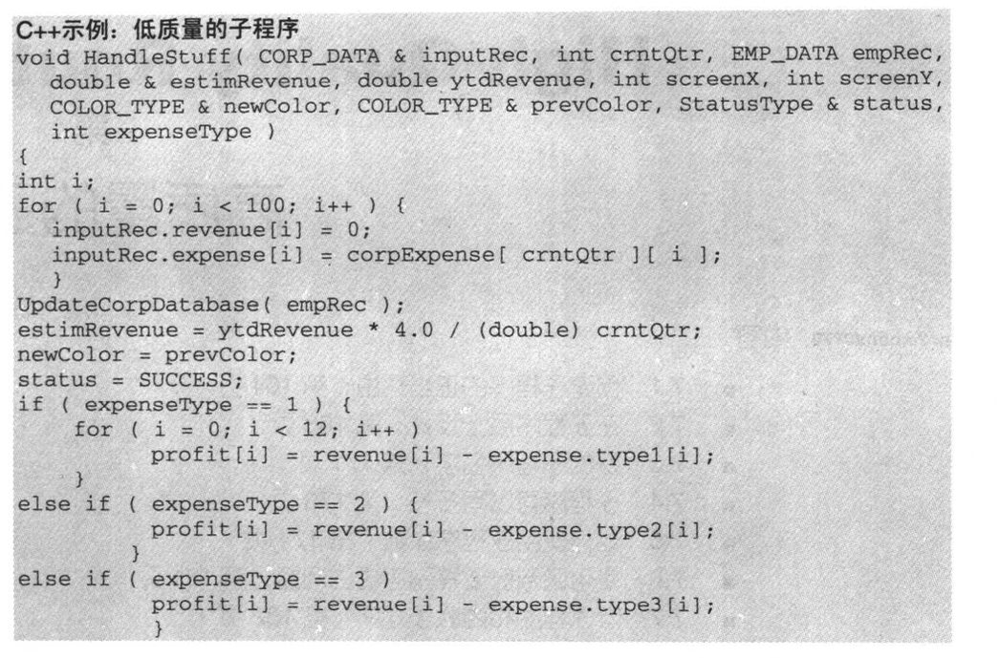

# 高质量的子程序

## routines

子程序是为了实现一个特定的目的而编写的一个可以被调用的方法或者过程, c和c++中的宏也可以被认为是子程序. 

糟糕的子程序的例子

这个程序的问题在哪里?

* 名字差劲, 没有体现这个程序的功能
* 布局不好, 代码的物理布局, 没有任何的逻辑组织的提示. 代码里面的编程风格不统一.
* 输入变量的值被改变了, inputRect, 如果是输入变量, 就不应该被改变, c 中可以const定义, 而如果需要被改变, 传入一个引用过来却没有被改变, 也是有问题的. 这点平时没有注意过.
* 这个程序读写了全局变量.
* 这个程序没有一个单一的目的.
* 这个程序没有注意防范错误数据, 例如除数是0.
* 这个程序用了magic number
* 这个程序有一些参数没有被使用.
* 这个程序的参数过多.
* 这个程序的参数顺序混乱.

子程序最主要的作用在于: 1 节省空间 2 提升性能.
节省空间在于, 如果不用程序调用的方式, 所有的代码都要完整的写在一起, 臃肿.
提升性能在于, 如果要对一段代码改善, 但是因为这段代码出现在不同的地方, 这些地方都要进行修改. 而用子程序的方式, 能很快的改善所有用到这段代码的地方的性能.

## 为什么要创建子程序

1. 降低复杂度.

子程序可以隐藏一些信息, 在调用的时候, 就可以不用考虑这些信息了. 在写子程序的时候, 自然要考虑这些, 但是写好之后, 调用的时候就应该忘记这些一些. 因为这样的原因, 在构建大的功能的时候, 将功能点分割, 可以很好的将责任划分, 每一层只考虑自己的问题. 将程序内部的代码, 抽取出子程序, 可以降低外层程序的复杂度.

1. 引入中间, 易懂的抽象.

子程序有名字, 而名字可以很好的解释, 这段程序是干什么的. 一段有名字的代码, 可以很好的帮助调用者组织自己的代码.

1. 避免代码重复

这个无需多说. 节省空间, 提升性能.

1. 子类化

覆盖一个简短而规整的子程序, 要比覆盖一个冗长邋遢的子程序要好的多, 出错的机会也会变少.

1. 隐藏顺序

一个很简单的例子, 一个模拟栈的类的代码, pop这个函数, 应该是提取栈顶元素, 然后将栈的length--, 这两个代码是由顺序的, 而且是必须在一起的. 还有, 读取用户输入, 然后读取配置文件, 这两个处理, 也是有顺序的. 对于这些有顺序的类似于原子调用的代码, 就应该写在子程序里面, 用这个子程序将执行顺序和信息都隐藏起来.

1. 隐藏指针操作.

指针操作会带来很大的复杂度, 将操作指针的工作, 包装在一起, 可以让外界忘记指针操作的危险, 同时, 如果之后可以有更好的数据结构代替指针, 也只用更改调用子程序, 和子程序内部的代码.

1. 提高可移植性.

将可能改变的代码通过子程序来隔离. 将不用改变的代码和可能改变的代码分开, 在之后迭代的时候会很有帮助.

1. 简化布尔判断.

一是布尔判断的条件, 可能很复杂, 再者布尔判断的变量名本身就有含义, 然后在取反, 有的时候很让人难以理解, 用子程序处理, 增加代码的可读性.

1. 改善性能

无需多言

1. 最好, 确保所有子程序都很小.

## 过于简单而没有必要编写子程序??

写一个简单的两三行的子程序, 看起来有些大材小用, 但是经验在于, 一个很好又小巧的子程序很有用.

1. 增加了可阅读性.

例如 points = deviceUnits * (POINT_PER_INCH / DEVICEUNITSPERINCHE())

这是一个转换操作, 如果用一个子程序处理, 子程序名可以很好地表明现在正在发生什么. 而且, 这段代码可能出现在很多地方, 两行的代码, 如果出现在3处地方, 就是6行, 而用子程序的方式, 调用的地方就只有一行代码了. 这对于减少调用者的代码长度很有用.

还有一个原因在于, 简单操作, 可能会变成很复杂的操作. 比如, 如果除数是0呢, 如果要考虑到这个, 每个地方又要增加对于是0的处理, 这个时候, 就不如统一放在子程序内部.

## 在子程序上设计代码

我们的目标是让, 子程序只把一件事做好, 不要在做其他额事.

对于子程序而言, 内聚性表示的是子程序中各个操作的紧密程度 .

下面的内聚性的说明, 是说子程序里面有着具体的代码, 而不是仅仅函数调用.

1. 功能的内聚性
    即一个子程序, 只做一件事
    
1. 顺序的内聚性
    子程序包含需要特定顺序完成的操作, 而这些操作是共享数据的, 只有完全执行之后, 才能完成一个完整的功能.

1. 通信的内聚性. (不好)
    子程序的不同操作使用相同的数据, 但是这两个操作没有联系.
    比如, 一个子程序先打印数据, 然后操作这个数据. 这两个功能没有联系, 仅仅是都用到了这份数据. 那么其实应该将打印数据抽取, 操作数据抽取, 然后在分别调用这两个子程序. 也就是将打印并操作的代码变成两个子功能子程序的调用, 而这连个子功能程序具有很好的内聚性.
    
1. 时间的内聚性
    某些操作要同时执行, 例如startUp中很多初始化的代码在一起. 这个时候, 应该避免的是在这个子程序内部直接编写初始化的代码, 而是将不同操作抽取成为各自具有功能内聚性的子程序, 然后在这里统一调用.
    例如 init() { initData(); initView(); initDialog()} 这样, init函数具有很强的内聚, 而各个被调用的子程序, 也有很强的内聚.

1. 逻辑上的内聚性(不好)
    根据一个参数, bool, 或者enum值, 执行不同的操作, 这些操作其实没有相关性, 但是就是被放在了一起. 如果说, 这个函数是一个switch之后, 调用其他子程序的代码, 那么这个子程序就是一个dispatcher, 那还算好, 因为这个子程序有很强的内聚性就是分派, 但是如果将具体的逻辑处理都写在这个子程序里面, 那就很糟糕.

1. 业务的内聚性(不好)
    操作界面要用户的名字, 地址, 年龄, 那么就在这个代码里面写获取这三项的代码, 如果增加一项工作经历, 就在这个代码里面增加工作经历的获取. 如果获取名字, 年龄, 就新写一个函数, 获取这两项. 这样每个函数, 都是一坨操作的集合, 这一坨操作, 仅仅是因为业务是这样的. 这个时候, 应该将功能分开, 而业务函数里面仅仅是调用内聚性强的微功能.

## 好的命名.

1. 描述子程序的所有事情.

    输出结果 + 副作用. 这两项都要表明出来, 但是含有副作用的命名又很长, 所以, 这就迫使你, 不要编写副作用的函数. 

1. 避免无意义, 或者含糊的动词. 

    例如handle, dealwith, 这些并不能说明函数的作用, 除非这个handle本身就有意义, 比如事件的统一处理. handleouput 就不如 formatandprintoutput. 如果函数名就是这种含糊不清的动词, 那么很有可能, 这个子程序就是一个含糊不清的程序, 它的目的并不明确. 有的时候, 我们需要这样的函数, 比如事件处理函数, 本身就是一个分派的角色,但是, 如果是一个具体操作的子程序, 尽量不要这样的命名.

1. 通过数字区别

1. 要对返回值有描述.

1. 过程的函数, 要用动词加宾语的形式. 而在类的方法中, 仅仅用动词就可以, 因为宾语默认是调用方法的对象.

1. 准确的使用对仗词.

## 子程序应该有多少行 (书中建议, 200之后就很危险.)

## 参数

1. 按照输入, 修改, 输出的顺序. 修改就是即输入, 又是输出的参数.
1. 如果几个程序都用了类似的参数, 顺序保持一致, 帮助记忆.
1. 使用所有的参数
1. 把状态, 或者出错变量放在最后, 这仅仅是附加的程序
1. 不要把参数作为工作变量.
    修改参数, 和输出参数, 自然要对变量值进行修改, 那也应该是确定要修改他们的时候.
    在函数内部, 需要一个变量保存中间状态, 尽量不要用参数, 而是另外分配一个变量. 参数只在用到的时候参与运算, 输入参数不应该被修改, 修改参数, 输出参数, 仅在需要被修改的时候被修改. 不然, 后面的程序, 可能还会认为, 参数里面的值还是初始值, 但是实际已经不是了.
1. 参数数量, 书中说7个, 但是我觉得还是太多, 4个已经很多.
1. 子程序参数是抽象对象还是多个变量.
    这个问题, 要考虑, 子程序需要面对的是一个对象, 还是几个值, 如果在调用子程序的时候, 发生了setup一个对象, 填入值, 然后takedown这个对象的时候, 这就表示, 这个子程序应该仅仅是需要几个变量值. 但是如果这个子程序, 就是操作对象的概念, 就应该填入这个对象.

